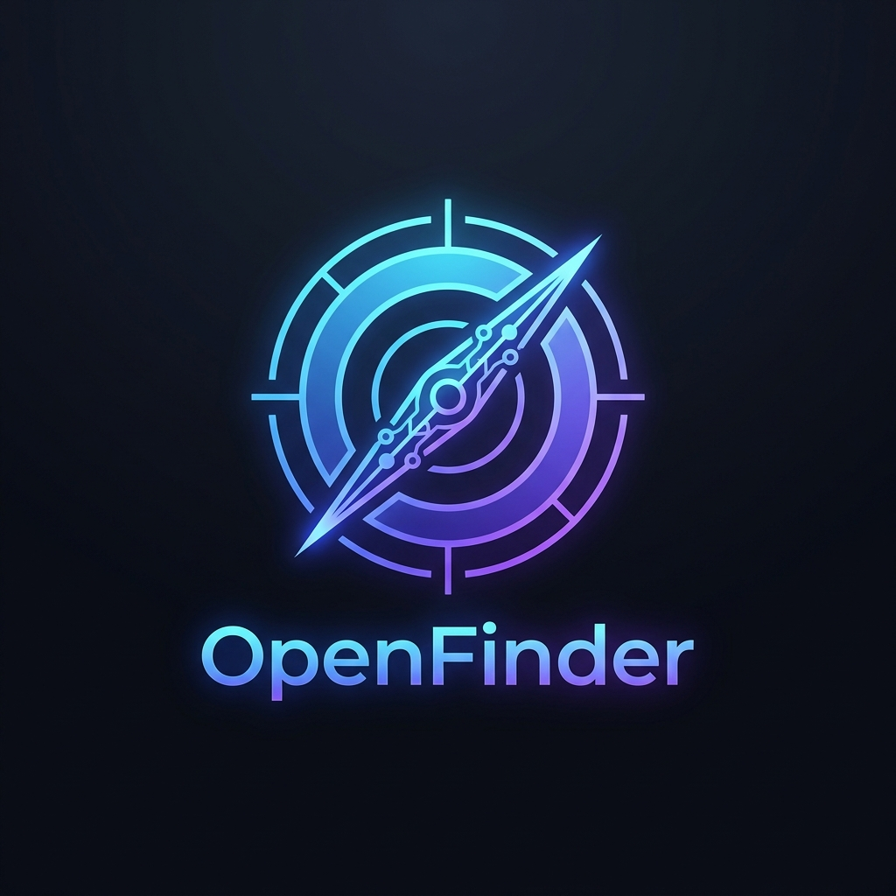

<p align="center">
  
</p>

<h1 align="center">🎯 OpenFinder v2.0 - Professional AI Career Suite</h1>

<p align="center">
  <strong>Universal AI Job Scout, Resume Matcher & Recruiter Intelligence Engine</strong><br>
  <em>Compatible with ChatGPT Actions, Claude Desktop MCP, Cursor & Multi-Agent Systems</em>
</p>

<p align="center">
  
  
  
  
</p>

---

## ✨ Key Features

- 📄 **Resume PDF Parser**: Automatically extracts technical skills, years of experience, and target roles from your PDF resume.
- 🔍 **Real-Time Hiring Search**: Finds active hiring posts without account bans (via zero-risk dorking queries).
- 🛡️ **Spam & CFBR Filter**: Strips out fake engagement-bait posts (*"Comment email below"*, *"CFBR"*).
- 📊 **Skill Match & Gap Analysis**: Computes exact Match Score % (e.g. `90% Match: React, Node.js, TypeScript` | `Missing: Docker`).
- ✉️ **Customized Recruiter Pitch**: Automatically drafts a personalized Cold LinkedIn DM / Cover Email referencing your specific resume highlights.

---

## 📂 Repository Structure

```text
linkedin-job-scout-mcp/
├── server.py                   # Main FastMCP Server exposing tools to Claude/ChatGPT
├── core/
│   ├── resume_parser.py        # PDF text extraction & skill identification
│   ├── linkedin_finder.py      # Real-time LinkedIn post finder
│   ├── post_parser.py          # Extracts emails, links, requirements from posts
│   ├── matcher.py              # Skill match score and gap calculation
│   └── spam_filter.py          # Filters spam and engagement-bait posts
├── test_pipeline.py            # Local standalone test script
├── config.py                   # Search defaults & skill taxonomies
├── requirements.txt            # Python dependencies
├── claude_desktop_config.json  # Configuration snippet for Claude Desktop
└── README.md                   # Setup and usage guide
```

---

## 🚀 Quick Setup

### 1. Install Dependencies
```bash
cd linkedin-job-scout-mcp
pip install -r requirements.txt
```

### 2. Test Locally (Optional)
Run the test pipeline to verify extraction and search:
```bash
python test_pipeline.py
```

---

## 🔌 Connecting to Claude Desktop

1. Open your Claude Desktop configuration file:
   - **Windows**: `%APPDATA%\Claude\claude_desktop_config.json`
   - **macOS**: `~/Library/Application Support/Claude/claude_desktop_config.json`

2. Add the `linkedin-job-scout` server:
```json
{
  "mcpServers": {
    "linkedin-job-scout": {
      "command": "python",
      "args": [
        "D:/projects/research/linkedin-job-scout-mcp/server.py"
      ]
    }
  }
}
```
*(Make sure to use forward slashes `/` in the file path).*

3. Restart Claude Desktop. You will see the 🔨 hammer icon indicating the MCP tools are active!

---

## 💬 Example Prompts to Use in Claude / ChatGPT

### 1. Find Jobs Matching Your Resume
> *"Here is my resume at `D:/my_resume.pdf`. Find recent LinkedIn hiring posts in Bangalore or Remote that match my skills with at least 60% match score."*

### 2. Search Hiring Posts by Keywords
> *"Search LinkedIn for recent Full Stack Developer hiring posts in India posted this week."*

### 3. Generate Cold DM for a Job Post
> *"Generate a personalized LinkedIn DM for this hiring post using my resume highlights at `D:/my_resume.pdf`."*

---

## 🛠️ MCP Tools Reference

| Tool Name | Parameters | Description |
|---|---|---|
| `parse_resume` | `pdf_path` | Extracts skills, estimated experience, and recommended roles from a PDF. |
| `search_jobs_by_resume` | `resume_path`, `location`, `timeframe`, `remote_only`, `min_match_score` | Reads resume, finds relevant LinkedIn hiring posts, and ranks by Match Score %. |
| `search_linkedin_hiring` | `keywords`, `location`, `timeframe`, `remote_only`, `max_results` | Searches recent hiring posts by keywords without requiring a resume. |
| `generate_recruiter_pitch` | `post_details`, `resume_path`, `candidate_name` | Drafts a high-converting Cold DM / Email application template. |

---

## 📄 License
MIT License - Open Source for developers and job seekers.
