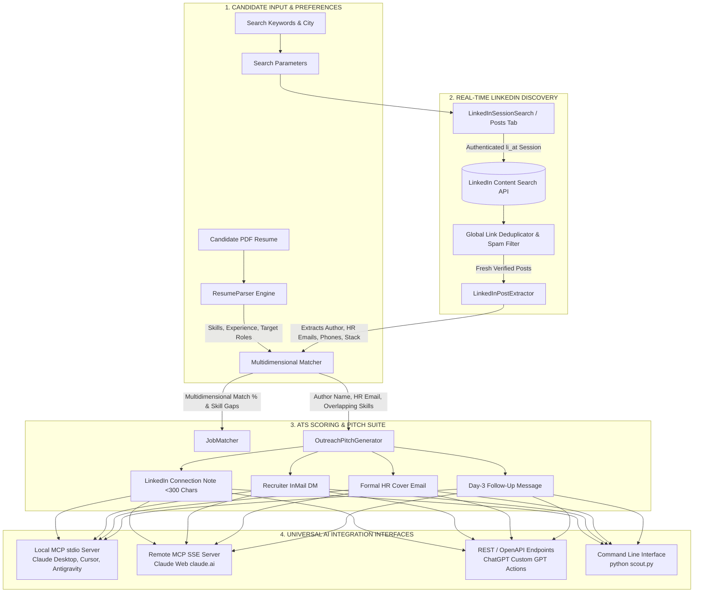

<p align="center">
  
</p>

<h1 align="center">🎯 OpenFinder v2.0 - Universal AI LinkedIn Scout & Recruiter Intelligence</h1>

<p align="center">
  <strong>Open-Source Real-Time LinkedIn Posts Scout, Resume ATS Matcher & Recruiter Outreach Engine</strong><br>
  <em>Plug &amp; Play with Claude Desktop, Claude Web (SSE), ChatGPT Actions, Cursor, Windsurf, Antigravity &amp; Python CLI</em>
</p>

<p align="center">
  
  
  
  
  
  
  
</p>

---

## 💡 What is OpenFinder?

**OpenFinder** is an open-source AI job seeker and recruiter discovery scout that bridges modern AI models (**Claude**, **ChatGPT**, **Cursor**, **Antigravity IDE**) directly to real-time LinkedIn recruiter hiring announcements.

Instead of searching stale corporate job listings on `/jobs/view/`, OpenFinder targets the **LinkedIn "Posts" Tab** where founders, engineering managers, and tech recruiters post direct hiring updates with direct HR emails, phone numbers, and WhatsApp contacts.

---

## 🔄 OpenFinder Workflow Architecture

The following diagram illustrates how OpenFinder captures candidate resumes, discovers live recruiter posts, executes ATS matching, and generates high-converting outreach pitches across all AI client platforms:



---

## ✨ Core Features & Capabilities

* 🌐 **Direct LinkedIn "Posts" Tab Search (`search_posts`)**: Queries LinkedIn's internal content feed with precise recency filters (`past-24h`, `past-week`, `past-month`) to discover unlisted, fresh hiring updates.
* 🎯 **Deep Recruiter Post Intelligence (`parse_linkedin_post`)**: Deeply extracts the hiring manager's name, company, direct HR contact email (`tanvi@...`), phone number, required tech stack, and raw post text.
* 📄 **Deep Resume PDF Parser (`parse_resume`)**: Extracts categorized skills (Frontend, Backend, Cloud, Databases), total years of experience, and target job titles.
* 📊 **Multidimensional ATS Matching (`match_resume_to_jobs`)**: Scores candidate profiles against live recruiter posts, outputting match %, matching skills, and missing skill gap recommendations.
* ✉️ **Automated Outreach Pitch Suite (`generate_recruiter_pitch`)**: Formats 4 high-converting outreach templates (LinkedIn Connection Notes under 300 characters, InMails, formal cover emails with pre-filled HR recipients, and follow-ups).
* ⚡ **70% Token Savings for LLMs**: Strips bloated raw HTML and redundant context, delivering compact, high-density structured JSON to Claude and ChatGPT.
* 🛡️ **Zero Repeated Links**: Built-in global deduplication engine ensures you never receive duplicate post links across queries or pagination runs.

---

## 🛠️ MCP Tools Overview

OpenFinder exposes 6 core tools compliant with the official Model Context Protocol (MCP):

| MCP Tool Name | Description | Key Arguments |
| :--- | :--- | :--- |
| `search_posts` | Search LinkedIn posts/content globally (the "Posts" tab) with recency filters. | `keywords`, `date_posted` (`past-24h` / `past-week`), `max_results` |
| `parse_linkedin_post` | Extract HR emails, phones, skills & generate pitches from any LinkedIn post URL. | `post_url`, `candidate_name`, `candidate_exp_years` |
| `search_hiring_posts` | Search verified hiring posts with location and work-mode filters. | `keywords`, `location`, `max_results` |
| `parse_resume` | Parse candidate PDF resume into structured profile, skills, and target roles. | `resume_path` |
| `match_resume_to_jobs`| Full ATS matching pipeline scoring resume against live recruiter posts. | `resume_path`, `keywords`, `location`, `max_results` |
| `generate_recruiter_pitch` | Generate tailored connection notes, InMails, cover emails, and follow-ups. | `job_title`, `company_name`, `matched_skills`, `candidate_name` |

---

## ⚡ Quick Start: Python CLI

### 1. Clone & Install
```bash
git clone https://github.com/thamodharangm/openfinder.git
cd openfinder
pip install -r requirements.txt
```

### 2. Configure Session (10 Seconds Setup)
To allow OpenFinder to query live LinkedIn posts from the last 24 hours without rate-limits:
1. Open [linkedin.com](https://www.linkedin.com) in your browser.
2. Press `F12` (Developer Tools) ➔ **Application** ➔ **Cookies** (`https://www.linkedin.com`).
3. Copy the value of the **`li_at`** cookie.
4. Create a `.env` file in the project root:
```env
LINKEDIN_LI_AT=AQEDAVNVT88...
LINKEDIN_JSESSIONID=ajax:7712255178776040103
```

### 3. Run Commands

```powershell
# 1. Search Live Posts from the past 24 hours
python scout.py --search-posts "React Developer hiring Bangalore" --date-posted past-24h

# 2. Extract HR Contacts & Pitches from a specific Post URL
python scout.py --post "https://www.linkedin.com/posts/codernkb_hiring-mernstack-developerintern-share-7497921508342878208-3o-y"

# 3. Match a Post directly against your Resume PDF
python scout.py --post "https://www.linkedin.com/posts/..." --resume "my_resume.pdf"
```

---

## 🔌 Connecting to AI Platforms

<details open>
<summary><h3>🤖 1. Claude Desktop (Local stdio MCP)</h3></summary>

Add OpenFinder to your `claude_desktop_config.json`:
- **Windows**: `%APPDATA%\Claude\claude_desktop_config.json`
- **macOS**: `~/Library/Application Support/Claude/claude_desktop_config.json`

```json
{
  "mcpServers": {
    "openfinder": {
      "command": "python",
      "args": [
        "D:/projects/research/linkedin-job-scout-mcp/server.py"
      ],
      "env": {
        "PYTHONUNBUFFERED": "1"
      }
    }
  }
}
```
*(Restart Claude Desktop to activate the tools).*
</details>

<details open>
<summary><h3>🌐 2. Claude Web (claude.ai Remote SSE Connector)</h3></summary>

1. Deploy OpenFinder on Render (or use your live Render URL: `https://openfinder.onrender.com`).
2. Set `LINKEDIN_LI_AT` in Render **Environment Variables**.
3. In **[claude.ai](https://claude.ai)** ➔ **Settings** ➔ **Integrations / MCP Connectors** ➔ **Add Connector**:
   ```text
   https://openfinder.onrender.com/sse
   ```
4. Now you can ask Claude Web: *"Search recent live LinkedIn hiring posts for React Developer in Bangalore in past 24 hours"*.
</details>

<details>
<summary><h3>💬 3. ChatGPT (Custom GPT OpenAPI Action)</h3></summary>

1. In ChatGPT, create a **Custom GPT** ➔ **Configure** ➔ **Actions** ➔ **Create new action**.
2. Import the schema from [`chatgpt_openapi_schema.json`](chatgpt_openapi_schema.json) or paste `https://openfinder.onrender.com/openapi.json`.
3. ChatGPT can now execute direct recruiter searches and ATS matching.
</details>

<details>
<summary><h3>⚡ 4. Cursor, Windsurf & Antigravity IDE</h3></summary>

In Cursor/Windsurf/Antigravity Settings ➔ **MCP Servers** ➔ **Add Server**:
- **Name**: `openfinder`
- **Type**: `command`
- **Command**: `python d:/projects/research/linkedin-job-scout-mcp/server.py`
</details>

---

## 🌐 1-Click Cloud Deployment (Render)

OpenFinder includes [`render.yaml`](render.yaml) and [`Dockerfile`](Dockerfile) for instant free cloud hosting:

1. Push your fork to GitHub.
2. Go to [dashboard.render.com](https://dashboard.render.com) ➔ **New Blueprint Instance** ➔ Select your repository.
3. In Render **Environment Variables**, add:
   - `LINKEDIN_LI_AT` = `your_cookie_here`
   - `LINKEDIN_JSESSIONID` = `your_jsessionid_here`
4. Access your live endpoints:
   - **Interactive Swagger UI**: `https://<YOUR-RENDER-URL>/docs`
   - **Claude Web MCP Stream**: `https://<YOUR-RENDER-URL>/sse`

---

## 📂 Project Structure

```text
linkedin-job-scout-mcp/
├── core/
│   ├── linkedin_session.py    # Authenticated LinkedIn Posts Tab Search & Deduplication
│   ├── linkedin_finder.py     # Multi-engine fallback search & dorking engine
│   ├── post_extractor.py      # Author, Company, HR Email & Phone Extractor
│   ├── resume_parser.py       # Deep PDF Resume Parser (Skills, Exp, Roles)
│   ├── matcher.py             # Multidimensional ATS Matching & Gap Scoring
│   ├── pitch_generator.py     # 4-Format Recruiter Outreach Generator
│   ├── spam_filter.py         # Spam, engagement-bait, and recruiter filter
│   └── cache.py               # In-memory search cache
├── .agents/
│   └── mcp_config.json        # Antigravity IDE MCP configuration
├── api_server.py              # FastAPI Cloud Server with SSE & OpenAPI endpoints
├── server.py                  # FastMCP Local stdio Server
├── scout.py                   # Full-featured Python CLI
├── chatgpt_openapi_schema.json# ChatGPT Custom Action Schema
├── claude_desktop_config.json # Claude Desktop configuration template
├── openfinderlogo.svg         # Clean minimalist vector brand logo
├── render.yaml                # Render Blueprint deployment definition
├── Dockerfile                 # Cloud container deployment file
└── requirements.txt           # Project dependencies
```

---

## 📜 License

This project is licensed under the **MIT License** — free for personal, commercial, and research use.
