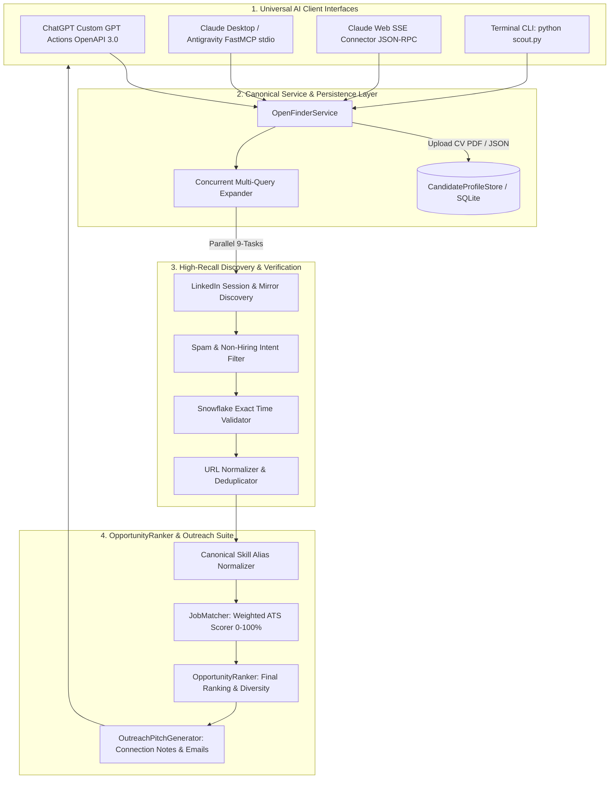

<p align="center">
  
</p>

<h1 align="center">🎯 OpenFinder v2.0 - Universal AI Job Catcher & Recruiter Scout</h1>

<p align="center">
  <strong>High-Precision, Real-Time LinkedIn Hiring Post Finder, Candidate Resume Matcher & Recruiter Outreach Engine</strong><br>
  <em>Dual Protocol API & Integration Hub for Claude Desktop (MCP), ChatGPT Custom GPT Actions, Cursor, Antigravity & Python CLI</em>
</p>

<p align="center">
  <a href="https://openfinder.onrender.com"></a>
  
  
  
  
</p>

---

## 💡 What is OpenFinder?

**OpenFinder** is an intelligent AI career discovery engine designed to bridge conversational AI agents (**Claude Desktop**, **ChatGPT Custom GPTs**, **Antigravity IDE**, and **Cursor**) directly to **verified, live recruiter hiring posts** on LinkedIn.

Unlike traditional job aggregators that display expired or spam listings, OpenFinder discovers genuine founder, hiring manager, and technical recruiter posts with direct contact emails and exact timestamp freshness.

### 🌟 Core Capabilities

* 🔍 **Verified `/posts/` Only**: Discovers exclusively genuine LinkedIn post announcements (`https://www.linkedin.com/posts/...`), rejecting noisy aggregator portals and promotional spam.
* ⚡ **Automatic 9-Task Concurrent Query Expansion**: Runs parallel multi-role searches (`React`, `MERN`, `Frontend`, `Node.js`, `React Native`, `Full Stack`) across target cities and Remote, returning **20+ verified opportunities by default** in sub-2-second queries.
* 🕒 **Snowflake Millisecond Freshness**: Decodes 64-bit LinkedIn Snowflake IDs (`(activity_id >> 22) / 1000`) for mathematical publication timestamp verification across `past-1h`, `past-4h`, `past-12h`, `past-24h`, and `past-7d`.
* 📄 **Hardened PDF Resume Parser**: Extracts candidate technical taxonomy, years of experience, contact information, and target roles.
* 🎯 **Canonical Skill Normalization & ATS Scoring**: Intelligently treats aliases as identical (`React.js == React`, `Node.js == Node`, `Express.js == Express`) and computes multi-dimensional ATS match percentages with actionable gap analysis.
* ✉️ **1-Click Recruiter Outreach Suite**: Extracts direct HR emails and phone numbers while generating tailored `<300` character LinkedIn connection notes and formal cover letters.

---

## 🏗️ System Architecture



---

## 🌐 Live Cloud Endpoints (`https://openfinder.onrender.com`)

| Endpoint | Method | Description | Key Parameters |
| :--- | :---: | :--- | :--- |
| `/` | `GET` | Server Health & Protocol Readiness Check | None |
| `/api/search-opportunities` | `GET` / `POST` | **Primary Opportunity Search** (20+ verified posts with ATS fit) | `query`, `location`, `timeframe`, `candidate_skills`, `candidate_exp_years`, `candidate_profile_id` |
| `/api/create-candidate-profile` | `POST` | Stores candidate JSON profile for persistent ATS scoring | `candidate_name`, `skills`, `years_of_experience`, `target_roles` |
| `/api/upload-resume` | `POST` | Multipart PDF resume upload & profile generator | `file` (PDF binary) |
| `/api/generate-pitch` | `POST` | Generates tailored outreach emails & notes | `job_title`, `company_name`, `matched_skills`, `candidate_name` |
| `/api/parse-post` | `GET` / `POST` | Deep intelligence extraction from any single LinkedIn post URL | `post_url`, `candidate_name` |
| `/api/search-posts` | `GET` / `POST` | Global keyword search on LinkedIn Posts tab | `keywords`, `date_posted`, `max_results` |

---

## 🔌 Integration Setup Guides

### 🟣 1. Claude Desktop Setup (MCP Connector)

Add OpenFinder to your `claude_desktop_config.json`:

* **Windows:** `%APPDATA%\Claude\claude_desktop_config.json`
* **macOS:** `~/Library/Application Support/Claude/claude_desktop_config.json`

```json
{
  "mcpServers": {
    "openfinder": {
      "command": "python",
      "args": [
        "d:/projects/research/linkedin-job-scout-mcp/server.py"
      ],
      "env": {
        "PYTHONUNBUFFERED": "1"
      }
    }
  }
}
```

#### 💬 Claude 1-Click Prompt (Just attach PDF resume):
```text
I have attached my resume PDF. Using OpenFinder (https://openfinder.onrender.com/):
1. Extract my technical stack, experience, and target roles.
2. Search for live, verified LinkedIn hiring posts in Bangalore & Remote from the LAST 24 HOURS (and past week).
3. Present all matching opportunities in a table with Match Score (%), Role & Company, Recruiter Name & Email, Location, Freshness, and 1-Click Apply Links.
4. Generate a ready-to-send LinkedIn connection note (<300 chars) for the top matched job.
```

---

### 🟢 2. ChatGPT Custom GPT Setup (OpenAPI 3.0 Actions)

1. Open **ChatGPT -> Explore GPTs -> Create New GPT**.
2. Navigate to **Configure -> Actions -> Create new action**.
3. In the **Schema** editor, paste the 100% compliant OpenAPI 3.0.1 schema:

```json
{
  "openapi": "3.0.1",
  "info": {
    "title": "OpenFinder Universal AI Job Scout",
    "description": "Live verified LinkedIn recruiter post finder and ATS job matcher.",
    "version": "2.0.0"
  },
  "servers": [
    {
      "url": "https://openfinder.onrender.com"
    }
  ],
  "paths": {
    "/api/search-opportunities": {
      "get": {
        "summary": "Search Verified LinkedIn Hiring Opportunities",
        "operationId": "searchOpportunities",
        "parameters": [
          {
            "name": "query",
            "in": "query",
            "schema": { "type": "string", "default": "React Developer" }
          },
          {
            "name": "location",
            "in": "query",
            "schema": { "type": "string", "default": "Bangalore" }
          },
          {
            "name": "timeframe",
            "in": "query",
            "schema": { "type": "string", "default": "past-24h" }
          },
          {
            "name": "max_results",
            "in": "query",
            "schema": { "type": "integer", "default": 20 }
          },
          {
            "name": "candidate_skills",
            "in": "query",
            "schema": { "type": "string" }
          },
          {
            "name": "candidate_exp_years",
            "in": "query",
            "schema": { "type": "integer", "default": 1 }
          },
          {
            "name": "candidate_name",
            "in": "query",
            "schema": { "type": "string" }
          }
        ],
        "responses": {
          "200": {
            "description": "Successful search results",
            "content": {
              "application/json": {
                "schema": {
                  "type": "object",
                  "properties": {
                    "status": { "type": "string" },
                    "count": { "type": "integer" },
                    "results": {
                      "type": "array",
                      "items": {
                        "type": "object",
                        "properties": {
                          "title": { "type": "string" },
                          "company": { "type": "string" },
                          "author": { "type": "string" },
                          "recruiter_emails": { "type": "array", "items": { "type": "string" } },
                          "location": { "type": "string" },
                          "posted_time": { "type": "string" },
                          "post_url": { "type": "string" },
                          "match_score": { "type": "integer" },
                          "matched_skills": { "type": "array", "items": { "type": "string" } }
                        }
                      }
                    }
                  }
                }
              }
            }
          }
        }
      }
    },
    "/api/create-candidate-profile": {
      "post": {
        "summary": "Create Candidate Profile from JSON",
        "operationId": "createCandidateProfile",
        "requestBody": {
          "required": true,
          "content": {
            "application/json": {
              "schema": {
                "type": "object",
                "properties": {
                  "candidate_name": { "type": "string" },
                  "email": { "type": "string" },
                  "phone": { "type": "string" },
                  "years_of_experience": { "type": "integer" },
                  "primary_role": { "type": "string" },
                  "skills": { "type": "array", "items": { "type": "string" } },
                  "target_roles": { "type": "array", "items": { "type": "string" } }
                }
              }
            }
          }
        },
        "responses": {
          "200": {
            "description": "Profile created",
            "content": {
              "application/json": {
                "schema": {
                  "type": "object",
                  "properties": {
                    "status": { "type": "string" },
                    "candidate_profile_id": { "type": "string" }
                  }
                }
              }
            }
          }
        }
      }
    },
    "/api/generate-pitch": {
      "post": {
        "summary": "Generate Outreach Pitch",
        "operationId": "generatePitch",
        "requestBody": {
          "required": true,
          "content": {
            "application/x-www-form-urlencoded": {
              "schema": {
                "type": "object",
                "required": ["job_title"],
                "properties": {
                  "job_title": { "type": "string" },
                  "company_name": { "type": "string", "default": "Hiring Team" },
                  "matched_skills": { "type": "string", "default": "React, Node.js" },
                  "candidate_name": { "type": "string", "default": "Candidate" },
                  "candidate_exp_years": { "type": "integer", "default": 1 }
                }
              }
            }
          }
        },
        "responses": {
          "200": {
            "description": "Pitch created",
            "content": {
              "application/json": {
                "schema": {
                  "type": "object",
                  "properties": {
                    "status": { "type": "string" },
                    "linkedin_connection_note_300_chars": { "type": "string" },
                    "formal_cover_email": { "type": "string" }
                  }
                }
              }
            }
          }
        }
      }
    }
  }
}
```

---

## 💻 Standalone Terminal CLI Usage (`scout.py`)

You can also run OpenFinder directly from your command line:

```bash
# 1. Search Live Recruiter Posts in Bangalore (Past 24 Hours)
python scout.py "React Developer" "Bangalore" -d past-24h -n 10

# 2. Match Opportunities against your PDF Resume
python scout.py --resume my_resume.pdf --location "Bangalore" -d past-7d

# 3. Deep Extract HR Email & Generate Pitch from a single LinkedIn Post URL
python scout.py --post "https://www.linkedin.com/posts/..." --resume my_resume.pdf

# 4. Search Global Posts Tab
python scout.py --search-posts "MERN Developer hiring Bangalore" -d past-24h
```

---

## 📦 Local Installation & Development

```bash
# Clone the repository
git clone https://github.com/thamodharangm/openfinder.git
cd openfinder

# Install dependencies
pip install -r requirements.txt

# Configure Environment Variables (Optional for direct LinkedIn cookie)
cp .env.example .env

# Run FastAPI Production Server Locally
uvicorn api_server:app --host 0.0.0.0 --port 8000 --reload
```

---

## 📄 License

Distributed under the **MIT License**. Free for personal and commercial usage.
