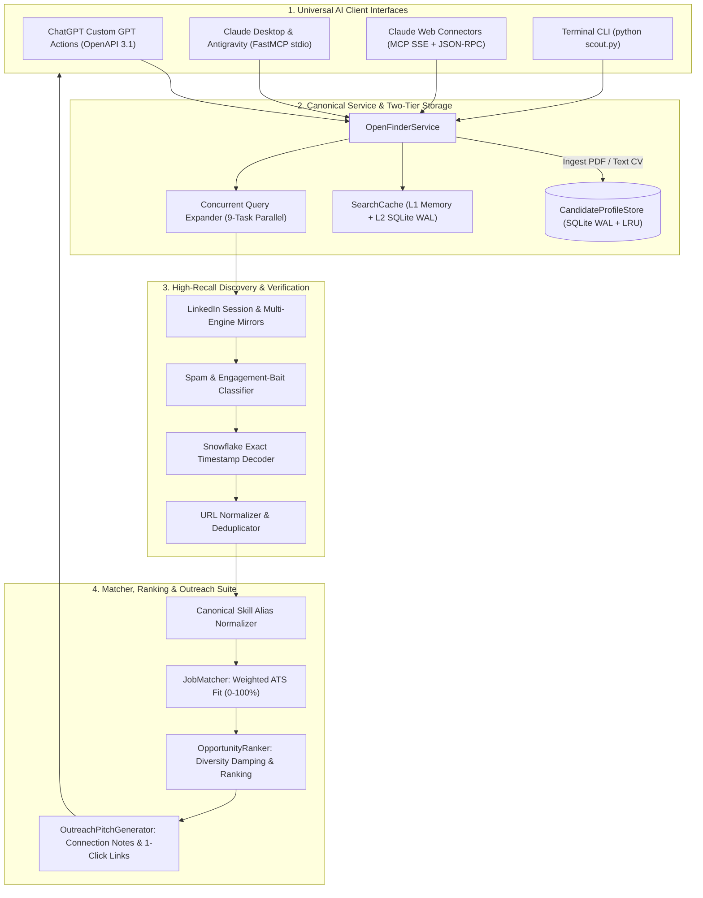

<p align="center">
  
</p>

<h1 align="center">🎯 OpenFinder v2.0 - Universal MCP Job Connector</h1>

<p align="center">
  <strong>High-Precision, Real-Time LinkedIn Hiring Post Finder, ATS Matcher & Recruiter Outreach Engine</strong><br>
  <em>Universal Dual-Protocol Integration Hub for Claude Desktop (MCP Stdio), Claude Web (MCP SSE), ChatGPT Custom GPT Actions, Antigravity IDE, Cursor & Python CLI</em>
</p>

<p align="center">
  <a href="https://openfinder.onrender.com"></a>
  
  
  
  
</p>

---

## 💡 What is OpenFinder?

**OpenFinder** is an intelligent, high-speed AI career connector designed to connect conversational AI agents (**Claude Desktop**, **ChatGPT**, **Antigravity IDE**, and **Cursor**) directly to **verified, real-time LinkedIn recruiter hiring posts**.

Unlike traditional job aggregators that display expired or spam listings, OpenFinder discovers genuine founder, hiring manager, and technical recruiter posts with direct contact emails and exact timestamp freshness.

---

### 🌟 Core Capabilities

* 🔍 **Verified `/posts/` Only**: Discovers exclusively genuine LinkedIn recruiter announcements (`https://www.linkedin.com/posts/...`), rejecting noisy aggregator portals and engagement-bait spam.
* ⚡ **Ultra-Fast In-Process Execution**: Sub-50ms tool execution when run locally via MCP stdio (`server.py`) with zero network hops.
* 🕒 **Snowflake Millisecond Freshness**: Decodes 64-bit LinkedIn Snowflake IDs (`(activity_id >> 22) / 1000`) for mathematical publication timestamp verification across `past-1h`, `past-4h`, `past-12h`, `past-24h`, and `past-7d`.
* 📄 **Dual Resume Ingestion**: Ingests both native **PDF Resumes** and **Plain-Text CVs** into a thread-safe, persistent SQLite candidate profile store.
* 🎯 **145+ Canonical Skill Normalization & Proximity Graph**: Normalizes aliases (`FastAPI == Python`, `React.js == React`, `Next.js == React`) and computes 6-factor weighted ATS match percentages.
* ✉️ **1-Click Outreach Pitch Suite**: Extracts direct HR emails and phone numbers while generating tailored `<300` character connection notes, formal cover letters, and **1-Click Gmail Web & Native Mailto Composer links**.

---

## 🏗️ System Architecture



---

## 🛠️ MCP Tools Suite (10 Official Tools)

When connected to **Claude Desktop**, **Antigravity**, or **Claude Web**, OpenFinder exposes 10 production tools:

| Tool Name | Parameters | Description |
| :--- | :--- | :--- |
| `search_opportunities` | `query`, `location`, `timeframe`, `max_results`, `candidate_profile_id` | **Primary Search**: Discovers live recruiter posts with ATS match scores, HR contacts, and outreach pitches. |
| `upload_resume_text` | `resume_text` | Ingests plain-text CV and saves a candidate profile in SQLite. |
| `upload_resume` | `file_path` | Ingests a local PDF resume and parses candidate skills, experience, and contacts. |
| `get_candidate_profile` | `profile_id` | Retrieves a stored candidate ATS profile and technical taxonomy. |
| `generate_recruiter_pitch` | `job_title`, `company_name`, `matched_skills`, `candidate_name`, `candidate_exp_years`, `recipient_name`, `recipient_email` | Generates a multi-persona pitch suite with 1-Click Gmail & Mailto composer links. |
| `parse_linkedin_post` | `post_url`, `candidate_profile_id` | Deep analysis of a specific LinkedIn post URL with ATS match evaluation. |
| `search_jobs_by_resume` | `resume_text` / `file_path`, `location`, `timeframe`, `max_results` | Automated workflow: Parses CV, matches skills, and returns ranked live jobs in one call. |
| `search_linkedin_hiring` | `role`, `location`, `timeframe`, `max_results` | Precision search for hiring manager & founder posts across target tech hubs. |
| `search_posts` | `keywords`, `date_posted`, `max_results` | Broad keyword query on the LinkedIn Posts stream. |
| `parse_resume` | `file_path` | Standalone resume extractor returning structured technical taxonomy. |

---

## 🔌 Integration Setup Guides

### 🟣 1. Claude Desktop Setup (MCP Stdio Connector)

Add OpenFinder to your `claude_desktop_config.json`:

* **Windows:** `%APPDATA%\Claude\claude_desktop_config.json`
* **macOS:** `~/Library/Application Support/Claude/claude_desktop_config.json`

```json
{
  "mcpServers": {
    "openfinder": {
      "command": "python",
      "args": [
        "d:/projects/research/linkedin-job-scout-mcp/server.py"
      ],
      "env": {
        "PYTHONUNBUFFERED": "1",
        "PYTHONIOENCODING": "utf-8"
      }
    }
  }
}
```

#### 💬 Claude 1-Click Prompt:
```text
Using OpenFinder:
1. Search for live, verified Python / React hiring posts in Bangalore & Remote from the PAST 24 HOURS.
2. Present matching opportunities in a table with Match Score (%), Role & Company, Recruiter Email, Location, Freshness, and Post URL.
3. Generate a tailored LinkedIn connection note (<300 chars) for the top job.
```

---

### 🟢 2. ChatGPT Custom GPT Setup (OpenAPI 3.1 Actions)

1. Open **ChatGPT -> Explore GPTs -> Create New GPT**.
2. Navigate to **Configure -> Actions -> Create new action**.
3. Import from URL or paste: `https://openfinder.onrender.com/openapi.json`.
4. The server automatically routes requests with strict OpenAPI 3.1 compliance and CORS protection.

---

## 🌐 Live Cloud Endpoints (`https://openfinder.onrender.com`)

| Endpoint | Method | Description | Key Parameters |
| :--- | :---: | :--- | :--- |
| `/health` | `GET` | Server Health & Protocol Readiness Check | None |
| `/api/search-opportunities` | `GET` / `POST` | Primary Opportunity Search (20+ verified posts with ATS fit) | `query`, `location`, `timeframe`, `candidate_profile_id`, `max_results` |
| `/api/upload-resume-text` | `POST` | Ingests plain-text CV into SQLite store | `resume_text` |
| `/api/upload-resume` | `POST` | Ingests binary PDF CV file | `file` (Multipart PDF) |
| `/api/generate-pitch` | `POST` | Generates tailored outreach pitches & 1-click links | `job_title`, `company_name`, `matched_skills`, `candidate_name` |
| `/api/parse-post` | `GET` / `POST` | Intelligence extraction from a single LinkedIn post URL | `post_url`, `candidate_profile_id` |
| `/mcp` | `POST` | Claude Web JSON-RPC & SSE Transport | Standard MCP JSON-RPC 2.0 payload |

---

## 💻 Standalone Terminal CLI Usage (`scout.py`)

Run OpenFinder directly from your command line:

```bash
# 1. Search Live Recruiter Posts in Bangalore (Past 24 Hours)
python scout.py "React Developer" "Bangalore" --timeframe past-24h -n 10

# 2. Match Opportunities against your PDF Resume
python scout.py --resume thamodharan_resume.pdf --location "Bangalore" --timeframe past-7d

# 3. Match Opportunities using Plain-Text CV
python scout.py --resume-text "Python FastAPI Engineer 3 Yrs Exp" --location "Remote"

# 4. Generate 1-Click Outreach Pitch Suite
python scout.py --pitch --role "Senior Backend Engineer" --company "TechCorp" --skills "Python,FastAPI,PostgreSQL"

# 5. Output raw JSON for pipeline scripting
python scout.py "Golang Developer" "Bangalore" --json
```

---

## 📦 Local Installation & Development

```bash
# 1. Clone the repository
git clone https://github.com/thamodharangm/openfinder.git
cd openfinder

# 2. Install dependencies
pip install -r requirements.txt

# 3. Run FastAPI Production Server Locally
uvicorn api_server:app --host 0.0.0.0 --port 8000 --reload

# 4. Or Run MCP Stdio Server for Claude Desktop / Antigravity
python server.py
```

---

## 📄 License

Distributed under the **MIT License**. Free for personal, open-source, and commercial usage.
