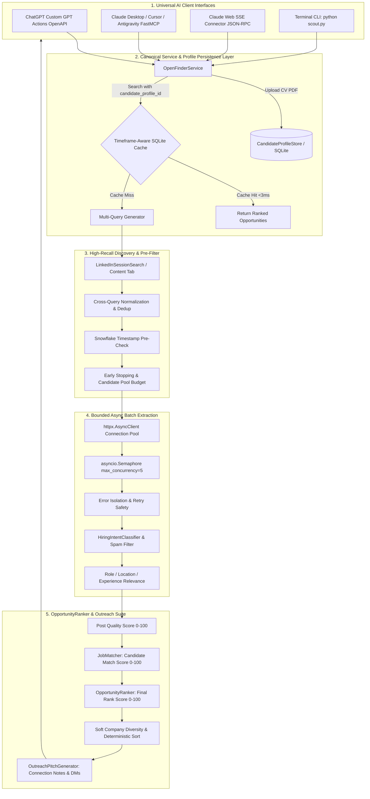

<p align="center">
  
</p>

<h1 align="center">🎯 OpenFinder v2.0 - Universal AI LinkedIn Scout & Recruiter Intelligence</h1>

<p align="center">
  <strong>High-Precision, Real-Time LinkedIn Hiring Post Finder, Candidate Resume Matcher & Recruiter Outreach Suite</strong><br>
  <em>Native Product Integration with ChatGPT Custom GPT Actions, Claude MCP / Connectors, Cursor, Antigravity &amp; Python CLI</em>
</p>

<p align="center">
  
  
  
  
  
  
  
</p>

---

## 💡 What is OpenFinder?

**OpenFinder** is an enterprise-grade AI career scout that connects modern conversational AI (**ChatGPT Custom GPTs**, **Claude Desktop / Web Connectors**, **Cursor**, **Antigravity IDE**) to genuine **LinkedIn hiring posts** published by founders, engineering managers, and technical recruiters.

### Key Capabilities:
1. **STRICT `/posts/` ONLY**: Discovers exclusively genuine LinkedIn post announcements (`https://www.linkedin.com/posts/...`), permanently rejecting job aggregator feeds, pulse articles, and company links.
2. **Persistent Candidate Profiles**: Upload your CV once via ChatGPT or Claude to obtain a `candidate_profile_id` stored in SQLite, enabling instant ATS matching on every subsequent search without re-uploading.
3. **Exact Minute-Level Freshness**: Enforces mathematical UTC freshness verification (`0 <= age < max_age`) supporting `past-1h`, `past-4h`, `past-12h`, `past-24h`, and `past-7d`.
4. **Directional Hiring Intent**: Distinguishes recruiters from `#OpenToWork` candidates and spam.
5. **Role Precision Filtering**: Employs semantic tech signals and negative stack dominance penalties (e.g., rejecting unrelated ColdFusion or DevOps posts for React searches).
6. **Bounded Async Concurrency**: Employs `httpx.AsyncClient` connection pooling with bounded semaphore concurrency (`max_concurrency=5`), delivering sub-2-second batch extractions.
7. **Opportunity Ranking Engine**: Combines Post Credibility (45%) and Candidate Resume Fit (55%) with deterministic tie-breakers and explainable evidence reasons.

---

## 🔄 End-to-End System Architecture



---

## ⚙️ Configuration & Environment Variables

Create a `.env` file in the root directory:

```env
# LinkedIn Authentication Session (Server-Side Secrets)
LINKEDIN_LI_AT="your_li_at_cookie_here"
LINKEDIN_JSESSIONID="your_jsessionid_here"

# Concurrency & Performance
OPENFINDER_CONCURRENCY=5

# Server & API
PORT=8000
HOST="0.0.0.0"
```

> [!IMPORTANT]
> LinkedIn cookies are strictly **server-side secrets**. OpenFinder never exposes credentials in API responses, logs, candidate profiles, or debug output.

---

## 🛠️ Canonical API & MCP Tools Overview

OpenFinder exposes standardized tools across ChatGPT Actions, Claude MCP, and REST:

| Tool / Endpoint | Interface | Description | Key Parameters |
| :--- | :--- | :--- | :--- |
| `upload_resume`<br>`/api/upload-resume` | ChatGPT / Claude / REST | Uploads and parses candidate PDF resume, persists profile, and returns a unique `candidate_profile_id`. | `file` (multipart/form-data) or `resume_path` |
| `get_candidate_profile`<br>`/api/candidate-profile/{id}` | ChatGPT / Claude / REST | Retrieves stored candidate profile, technical skills, and seniority level by ID. | `candidate_profile_id` |
| `search_opportunities`<br>`/api/search-opportunities` | ChatGPT / Claude / REST | **Canonical search tool**. Searches verified LinkedIn hiring `/posts/` with exact freshness validation and ATS candidate fit ranking. | `query`, `location`, `timeframe`, `max_results`, `candidate_profile_id` |
| `generate_recruiter_pitch`<br>`/api/generate-pitch` | ChatGPT / Claude / REST | Formats 4 high-converting outreach templates (Connection Note <300 chars, InMail, Email, Follow-up). | `job_title`, `company_name`, `matched_skills` |
| `search_posts` | Claude / CLI | Searches LinkedIn posts globally by keyword with exact publication time verification. | `keywords`, `date_posted`, `max_results` |
| `parse_linkedin_post` | Claude / CLI | Directly extracts HR contact emails, phone numbers, and required skills from any `/posts/` URL. | `post_url`, `candidate_name`, `candidate_exp_years` |

---

## 🤖 ChatGPT Custom GPT Actions Integration

To connect OpenFinder to your Custom GPT:

1. In ChatGPT GPT Editor $\rightarrow$ **Configure** $\rightarrow$ **Actions** $\rightarrow$ **Create new action**.
2. Paste the contents of [`chatgpt_openapi_schema.json`](file:///d:/projects/research/linkedin-job-scout-mcp/chatgpt_openapi_schema.json).
3. Set Server URL to your deployment URL (e.g. `https://openfinder.onrender.com` or `http://localhost:8000`).
4. In GPT Instructions, specify:
   ```text
   When the user provides a resume, call `uploadResume` to create a candidate profile.
   When the user asks for jobs, call `searchOpportunities` with their `candidate_profile_id`, role, location, and timeframe.
   Always present opportunities clearly with Company, Role, Location, Age, Match Score, Recruiter Contact, and Direct Post Link.
   ```

---

## 🧠 Claude MCP Setup (Desktop, Cursor, Antigravity)

Add OpenFinder to your `claude_desktop_config.json`:

```json
{
  "mcpServers": {
    "openfinder": {
      "command": "python",
      "args": ["d:/projects/research/linkedin-job-scout-mcp/server.py"],
      "env": {
        "LINKEDIN_LI_AT": "your_cookie_here"
      }
    }
  }
}
```

---

## ⚡ Quick Start & CLI Usage

```bash
# 1. Install dependencies
pip install -r requirements.txt

# 2. Search React Developer posts in Bangalore from past 24 hours
python scout.py "React Developer" "Bangalore" --date-posted past-24h

# 3. Search and match against candidate resume
python scout.py --resume sample_resume.pdf --location Bangalore --date-posted past-24h

# 4. Start FastAPI server for ChatGPT Actions / Claude Web
python api_server.py
```

---

## 🧪 Comprehensive Test Suites

Run the full automated test matrix covering all architectural and product guarantees:

```bash
# Phase 1: URL Safety & Timestamp Boundaries
python test_phase1.py

# Phase 2: Hiring Intent & Recruiter vs Job Seeker Classification
python test_phase2.py

# Phase 3: Role Precision & Negative Technology Penalties
python test_phase3.py

# Phase 4: Discovery Pagination & Candidate Budgeting
python test_phase4.py

# Phase 5: Async Batch Concurrency & Connection Pooling
python test_phase5.py

# Phase 6: Multi-Signal Opportunity Ranking & Deterministic Sort
python test_phase6.py

# Phase 7: Production Hardening, Security Boundaries & Corruption Recovery
python test_phase7.py

# Phase 8: ChatGPT Actions, Claude MCP & Candidate Profile Store
python test_phase8.py

# End-to-End Career Suite Demonstration
python test_pipeline.py
```

---

## 📄 License
MIT License. Open-source for all developers and AI agents.
