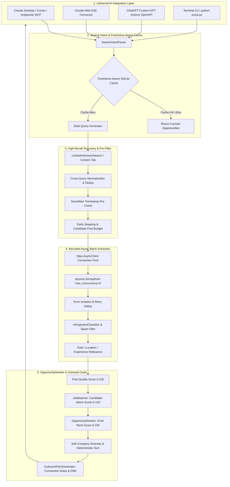

<p align="center">
  
</p>

<h1 align="center">🎯 OpenFinder v2.0 - Universal AI LinkedIn Scout & Recruiter Intelligence</h1>

<p align="center">
  <strong>High-Precision, Real-Time LinkedIn Hiring Post Finder, Resume ATS Matcher & Recruiter Outreach Suite</strong><br>
  <em>Plug &amp; Play with Claude Desktop, Claude Web (SSE), ChatGPT Actions, Cursor, Windsurf, Antigravity &amp; Python CLI</em>
</p>

<p align="center">
  
  
  
  
  
  
</p>

---

## 💡 What is OpenFinder?

**OpenFinder** is an enterprise-grade AI career scout that connects modern AI systems (**Claude Desktop/Web**, **ChatGPT Actions**, **Cursor**, **Antigravity IDE**) to genuine **LinkedIn hiring posts** published by founders, engineering managers, and technical recruiters.

Unlike conventional job boards that index stale `/jobs/view/` corporate listings:
1. **STRICT `/posts/` ONLY**: Discovers exclusively genuine LinkedIn post announcements (`https://www.linkedin.com/posts/...`), permanently rejecting job aggregator feeds, pulse articles, and company links.
2. **Exact Minute-Level Freshness**: Enforces mathematical UTC freshness verification (`0 <= age < max_age`) supporting `past-1h`, `past-4h`, `past-12h`, `past-24h`, and `past-7d`.
3. **Directional Hiring Intent**: Distinguishes recruiters from `#OpenToWork` candidates and spam.
4. **Role Precision Filtering**: Employs semantic tech signals and negative stack dominance penalties (e.g., rejecting unrelated ColdFusion, PHP, or DevOps posts for React searches).
5. **Async Batch Concurrent Extraction**: Employs `httpx.AsyncClient` connection pooling with bounded semaphore concurrency (`max_concurrency=5`), delivering sub-2-second batch extractions.
6. **Multi-Signal Opportunity Ranking**: Separates Post Quality (45%) from Candidate Resume Fit (55%) with deterministic tie-breakers and explainable evidence reasons.

---

## 🔄 End-to-End System Architecture



---

## ⚙️ Configuration & Environment Variables

Create a `.env` file in the root directory:

```env
# LinkedIn Authentication Session (Optional, for authenticated Content tab search)
LINKEDIN_LI_AT="your_li_at_cookie_here"
LINKEDIN_JSESSIONID="your_jsessionid_here"

# Concurrency & Performance
OPENFINDER_CONCURRENCY=5

# Server & API
PORT=8000
HOST="0.0.0.0"
```

---

## 🛠️ MCP Tools Overview

OpenFinder exposes 6 core tools compliant with the official Model Context Protocol (MCP):

| MCP Tool Name | Description | Key Parameters |
| :--- | :--- | :--- |
| `search_hiring_posts` | Searches verified LinkedIn hiring `/posts/` with location, timeframe, and work-mode filters. | `keywords`, `location`, `timeframe`, `max_results` |
| `parse_linkedin_post` | Extracts direct HR emails, phones, required skills, and generates pitches from any LinkedIn post URL. | `post_url`, `candidate_name`, `candidate_exp_years` |
| `search_posts` | Searches LinkedIn posts globally with exact publication time verification. | `keywords`, `date_posted`, `max_results` |
| `parse_resume` | Parses candidate PDF resume into structured profile, technical skills, and target roles. | `resume_path` |
| `match_resume_to_jobs`| Executes full ATS matching pipeline scoring resume against live recruiter posts. | `resume_path`, `keywords`, `location`, `max_results` |
| `generate_recruiter_pitch` | Formats 4 high-converting outreach templates (Connection Note <300 chars, InMail, Email, Follow-up). | `job_title`, `company_name`, `matched_skills` |

---

## ⚡ Quick Start & CLI Usage

### 1. Install Dependencies
```bash
pip install -r requirements.txt
```

### 2. Search Live Posts in Terminal
```bash
# Search React Developer posts in Bangalore from the past 24 hours
python scout.py "React Developer" "Bangalore" --date-posted past-24h

# Search ultra-fresh posts from the past 1 hour
python scout.py "React Developer" "Bangalore" --date-posted past-1h

# Search and match against candidate resume
python scout.py --resume sample_resume.pdf --location Bangalore --date-posted past-24h
```

### 3. Run FastAPI / Claude Web Server
```bash
python api_server.py
# Open Swagger Docs at http://127.0.0.1:8000/docs
```

### 4. Run MCP Server (Claude Desktop / Cursor / Antigravity)
```bash
python server.py
```

---

## 🧪 Comprehensive Test Suites

Run the full automated test matrix covering all architectural guarantees:

```bash
# URL Safety & Timestamp Boundaries
python test_phase1.py

# Hiring Intent & Author Type Classification
python test_phase2.py

# Role Precision & Tech Signal Filtering
python test_phase3.py

# Discovery Pagination & Candidate Budgeting
python test_phase4.py

# Async Batch Concurrency & Error Isolation
python test_phase5.py

# OpportunityRanker & Deterministic Tie-Breaking
python test_phase6.py

# Production Hardening, Security & Edge Cases
python test_phase7.py

# End-to-End Career Suite Demonstration
python test_pipeline.py
```

---

## 📄 License
MIT License. Open-source for all developers and AI agents.
